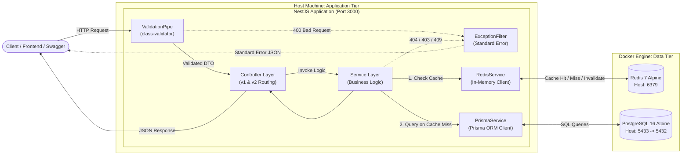
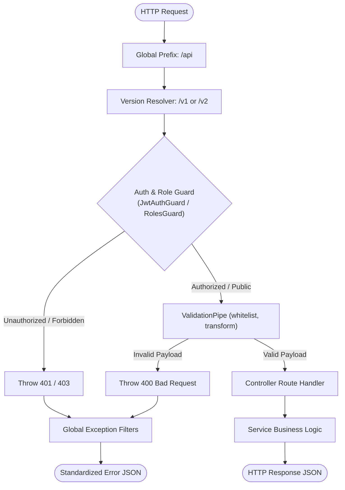
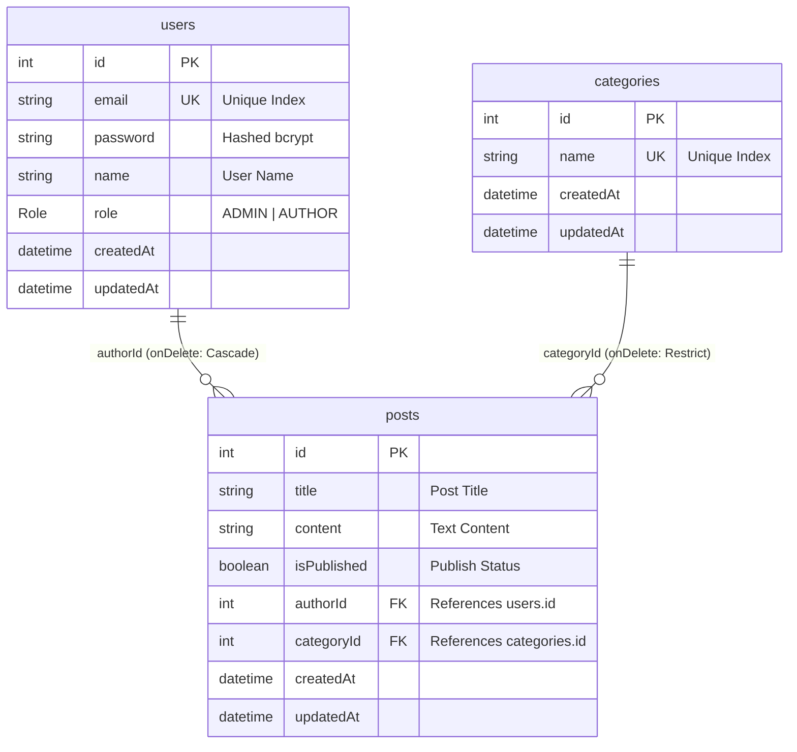

# NestJS + Prisma + PostgreSQL Blog CMS API

> [ROADMAP] แผนที่เส้นทางการเรียนรู้ (Learning Flow): แนะนำให้เริ่มศึกษาตามลำดับได้ที่ [docs/LEARNING_ROADMAP.md](docs/LEARNING_ROADMAP.md)  
> [GUIDE] คู่มือเจาะลึก 9 เสาหลัก Backend ฉบับสมบูรณ์: อ่านเนื้อหาภาคทฤษฎีและแนวคิดได้ที่ [docs/blog-api-guide.md](docs/blog-api-guide.md)

---

## Technical Specifications Matrix

| Layer | Technology | Details |
|---|---|---|
| **Runtime & Language** | Node.js (v18+) / TypeScript 5 | Native ECMAScript Modules (ESM) |
| **Framework** | NestJS 12 | Modular Enterprise Architecture |
| **Database** | PostgreSQL 16 (Alpine) | Docker Container (Host Port 5433 -> Container 5432) |
| **Object-Relational Mapping** | Prisma 6 | Type-Safe Database Client, Relations, Migrations |
| **Cache Storage** | Redis 7 (Alpine) | In-Memory Data Store (Port 6379), Cache-Aside Strategy |
| **Authentication & Security** | Passport JWT / bcrypt | Role-Based Access Control (ADMIN / AUTHOR), Ownership Guards |
| **Validation & Serialization** | class-validator / class-transformer | Strict Whitelist & Type Casting |
| **API Versioning** | URI-based Versioning | Default v1 with Advanced v2 Endpoints |
| **API Documentation** | Swagger (OpenAPI 3.0) | Interactive Documentation with Bearer Auth |
| **Automated Testing** | Vitest / vitest-mock-extended | 46 Unit Tests across 6 Test Suites (Deep Mocking) |

---

## Key Features

- **[FRAMEWORK] NestJS 12 Architecture**: โครงสร้างแบบแยกส่วน (Modular Architecture) สเกลง่าย เป็นระเบียบตามหลัก Separation of Concerns (SoC)
- **[SECURITY] Authentication & JWT**: ระบบสมัครสมาชิก, เข้าสู่ระบบ และออก Access Token ด้วย Passport และ JSON Web Token
- **[RBAC] Role-Based Access Control**: แบ่งระดับสิทธิ์ผู้ใช้เป็น `ADMIN` และ `AUTHOR` พร้อมระบบ Ownership Authorization ปกป้องบทความของผู้เขียน
- **[CRYPTOGRAPHY] Password Hashing (bcrypt)**: เข้ารหัสผ่านอย่างปลอดภัยด้วย Salt Rounds ก่อนบันทึกลงฐานข้อมูล
- **[CACHE] In-Memory Caching (Redis 7)**: กลยุทธ์ **Cache-Aside Pattern** บน `GET /api/v2/posts` (TTL = 60s) พร้อมระบบ Non-blocking Cache Invalidation (`scanStream`)
- **[DATABASE] PostgreSQL & Prisma 6**: Data Modeling ที่มี Type-Safety สูงสุด พร้อมความสัมพันธ์ 1-to-Many, Cascade Delete และ Restrict Delete
- **[VALIDATION] Strict DTO Validation**: ป้องกันช่องโหว่ Mass Assignment ด้วย `class-validator` และ `whitelist: true`
- **[VERSIONING] URI API Versioning**: รองรับทั้ง `/api/v1` (CRUD ปกติ) และ `/api/v2` (Pagination, Metrics, Analytics)
- **[FILTER] Global Exception Filters**: ระบบดักจับ Error และแปลงเป็น JSON Format มาตรฐานเดียวกันทั้งระบบ
- **[API-DOCS] Swagger Documentation**: Interactive Web UI พร้อมปุ่ม Authorize สำหรับทดสอบ API ด้วย JWT Token
- **[CONTAINER] One-Command Dev Environment**: สคริปต์เปิด Docker PostgreSQL + Redis + ซิงค์ Schema อัตโนมัติในคำสั่งเดียว

---

## System Architecture & Request Flow

### 1. Overall System Topology



### 2. Request Lifecycle Pipeline



---

## Database Schema & Relations



### Relational Integrity & Constraint Matrix

| Relationship | Constraint | Type | Action on Delete | Business Rationale |
|---|---|---|---|---|
| `User -> Post` | `authorId` | Foreign Key | **Cascade** | เมื่อลบผู้ใช้ โพสต์ของผู้ใช้นั้นจะถูกลบทั้งหมด ป้องกันข้อมูลกำพร้า (Orphan Data) |
| `Category -> Post` | `categoryId` | Foreign Key | **Restrict** | ห้ามลบหมวดหมู่หากยังมีโพสต์ผูกอยู่ เพื่อรักษาความสมบูรณ์ของบทความ |
| `User.email` | `email` | Unique Index | **Reject Duplicate** | ป้องกันการสมัครสมาชิกซ้ำซ้อน และเพิ่มความเร็วในการสืบค้นตอน Login |
| `Category.name` | `name` | Unique Index | **Reject Duplicate** | ชื่อหมวดหมู่ต้องไม่ซ้ำกันในระบบ |

---

## Core Backend Concepts in this Repository

### 1. Controllers vs Services vs Modules
- **Controller**: รับ HTTP Request, อ่านค่าพารามิเตอร์ (`@Param`, `@Body`, `@Query`), และตอบกลับผลลัพธ์ (ห้ามเขียนคำสั่งฐานข้อมูลที่นี่)
- **Service**: ศูนย์รวม Business Logic เช่น การตรวจสอบอีเมลซ้ำ, ตรวจสอบสิทธิ์ความเป็นเจ้าของบทความ, การคำนวณสถิติ
- **Module**: กำแพงล้อมขอบเขตของ Feature จัดการการรวม Component และกำหนด Provider ที่ต้องการ Export ไปใช้งานซ้ำ

### 2. Dependency Injection (DI) & Inversion of Control (IoC)
แทนการประกาศ `new PrismaClient()` หรือ `new Redis()` ในแต่ละไฟล์ NestJS IoC Container จะสร้าง Singleton Instance เพียงครั้งเดียว แล้วส่ง (Inject) เข้าสู่ Constructor ของแต่ละ Service อัตโนมัติ ช่วยลด Memory Overhead และทำให้การเขียน Unit Test สะดวกผ่าน Mocking

### 3. DTO (Data Transfer Object) & Input Validation
การรับ Request Body มีคลาส DTO รองรับเสมอ พร้อม Decorator ตรวจสอบ:
- `@IsEmail()`: ตรวจสอบความถูกต้องของรูปแบบอีเมล
- `@MinLength(6)`: บังคับความยาวขั้นต่ำ
- `@IsOptional()`: ใช้สำหรับการ Update ข้อมูลบางส่วน (PATCH)
- `@Type(() => Number)`: แปลงค่า String ให้เป็น Number อัตโนมัติ

### 4. Custom Global Exception Filters
เมื่อเกิด Error ระบบจะไม่ส่ง Raw Exception Stacktrace ไปยังผู้ใช้ แต่จะแปลงเป็น JSON Format มาตรฐาน:
```json
{
  "statusCode": 400,
  "timestamp": "2026-09-29T12:00:00.000Z",
  "path": "/api/v1/users",
  "message": ["email must be an email"]
}
```

### 5. API Versioning & Performance Optimization
- **Version 1 (`/api/v1`)**: CRUD พื้นฐาน คืนค่า Flat Array
- **Version 2 (`/api/v2`)**: แบ่งหน้าด้วย Database Pagination (`skip`, `take`), ค้นหา Keyword (Case-Insensitive), และใช้ `Promise.all` รัน `count` และ `findMany` พร้อมกันเพื่อลดเวลา Query

### 6. Cache-Aside Pattern with Redis
ใน Endpoint `GET /api/v2/posts`:
1. ตรวจสอบใน Redis Cache ก่อนด้วย Unique Cache Key (`posts:v2:p<page>:l<limit>:s<search>:c<categoryId>`)
2. **Cache Hit**: คืนค่ากลับทันที (< 5ms) โดย Database ไม่ต้องทำงาน
3. **Cache Miss**: คิวรีจาก PostgreSQL -> บันทึกลง Redis พร้อม TTL (60s) -> คืนค่าให้ Client
4. **Safe Invalidation**: เมื่อมีการ Create, Update หรือ Delete ระบบจะใช้ `scanStream` ล้างแคช `posts:v2:*` แบบ Non-blocking

---

## API Endpoints Reference

### Version 1 (`/api/v1`) - Standard CRUD

| Method | Endpoint | Access Level | Description |
|---|---|---|---|
| `POST` | `/api/v1/auth/register` | Public | สมัครสมาชิกใหม่ (Register & get JWT) |
| `POST` | `/api/v1/auth/login` | Public | เข้าสู่ระบบ (Login & get JWT) |
| `GET` | `/api/v1/auth/profile` | Authenticated | ดูโปรไฟล์ผู้ใช้ปัจจุบันจาก JWT |
| `POST` | `/api/v1/users` | Public | สร้างผู้ใช้งาน |
| `GET` | `/api/v1/users` | Public | ดึงรายชื่อผู้ใช้ทั้งหมด |
| `GET` | `/api/v1/users/:id` | Public | ดึงข้อมูลผู้ใช้รายบุคคลพร้อมบทความที่เขียน |
| `PATCH` | `/api/v1/users/:id` | Public | แก้ไขข้อมูลผู้ใช้ |
| `DELETE` | `/api/v1/users/:id` | Public | ลบผู้ใช้ (Cascade ลบบทความ) |
| `POST` | `/api/v1/categories` | ADMIN only | สร้างหมวดหมู่ใหม่ |
| `GET` | `/api/v1/categories` | Public | ดึงหมวดหมู่ทั้งหมดพร้อมจำนวนบทความ (`_count`) |
| `GET` | `/api/v1/categories/:id` | Public | ดึงหมวดหมู่ตาม ID พร้อมบทความในหมวดหมู่ |
| `PATCH` | `/api/v1/categories/:id` | ADMIN only | แก้ไขชื่อหมวดหมู่ |
| `DELETE` | `/api/v1/categories/:id` | ADMIN only | ลบหมวดหมู่ (Restrict หากยังมีบทความ) |
| `POST` | `/api/v1/posts` | Authenticated | สร้างบทความ (ผูก `authorId` จาก Token อัตโนมัติ) |
| `GET` | `/api/v1/posts` | Public | ดึงบทความทั้งหมดแบบ Flat Array |
| `GET` | `/api/v1/posts/published` | Public | ดึงเฉพาะบทความที่เผยแพร่แล้ว (`isPublished = true`) |
| `GET` | `/api/v1/posts/:id` | Public | ดึงบทความตาม ID พร้อมชื่อผู้เขียนและหมวดหมู่ |
| `PATCH` | `/api/v1/posts/:id` | Owner / Admin | แก้ไขบทความ (เฉพาะผู้เขียนเดิม หรือ Admin) |
| `DELETE` | `/api/v1/posts/:id` | Owner / Admin | ลบบทความ (เฉพาะผู้เขียนเดิม หรือ Admin) |

---

### Version 2 (`/api/v2`) - Advanced Endpoints

| Method | Endpoint | Query Parameters | Description |
|---|---|---|---|
| `GET` | `/api/v2/posts` | `page`, `limit`, `search`, `categoryId` | คืนค่าบทความแบบแบ่งหน้า พร้อม Redis Caching (TTL 60s) และ Metadata |
| `GET` | `/api/v2/posts/stats` | - | สรุปสถิติบทความ (Total, Published, Drafts, Categories) |
| `GET` | `/api/v2/posts/:id` | - | ดึงบทความเดี่ยว พร้อมคำนวณ Reading Time และแนะนำ Related Posts |

### API Capabilities Comparison: V1 vs V2

| Capability | Version 1 (`/api/v1/posts`) | Version 2 (`/api/v2/posts`) |
|---|---|---|
| **Data Format** | Flat Array ก้อนเดียว | Paginated Envelope (`data` + `meta`) |
| **Database Pagination** | ไม่มี (ดึงทั้งหมด) | มี (`skip` และ `take` ตามหน้า) |
| **Search & Filtering** | ไม่มี | รองรับ Search Keyword และ Filter ตาม Category |
| **In-Memory Caching** | ไม่มี | มี Redis Cache-Aside (TTL 60s) |
| **Concurrency Query** | Sequential | Parallel ด้วย `Promise.all` |
| **Additional Analytics** | ไม่มี | มี `/stats` และการคำนวณ Reading Time |

---

## Setup & Running Guide

### Prerequisites
- Node.js (v18 หรือใหม่กว่า)
- Docker Desktop (สำหรับรัน PostgreSQL และ Redis)

### Execution Steps

1. **Clone repository และติดตั้ง Dependencies:**
   ```bash
   git clone <repo-url>
   cd nestjs-prisma-blog-api
   npm install
   ```

2. **เปิดโปรแกรม Docker Desktop**

3. **รันระบบทั้งหมดด้วยคำสั่งเดียว:**
   ```bash
   npm run start:dev
   ```
   *สคริปต์จะตรวจสอบ Docker, สตาร์ท PostgreSQL Container บน Port 5433, สตาร์ท Redis Container บน Port 6379, ซิงค์ Prisma Schema, และเปิด NestJS Server แบบ Hot Reload ให้อัตโนมัติ*

4. **เปิดดูเอกสารและทดสอบ API:**
   - Scalar UI (Modern Client): [http://localhost:3000/api/reference](http://localhost:3000/api/reference)
   - Swagger UI: [http://localhost:3000/api/docs](http://localhost:3000/api/docs)
   - Base API URL: [http://localhost:3000/api](http://localhost:3000/api)

---

## Database & Cache Inspection Tools

| Tool | Target Storage | Connection Type | Parameters / Command | Primary Use Case |
|---|---|---|---|---|
| **DBeaver** | PostgreSQL | Desktop GUI Client | Host: `localhost`, Port: `5433`, DB: `nestjs_blog`, User/Pass: `postgres`/`postgres` | ออกแบบตาราง, รัน SQL Query, จัดการ Index |
| **Prisma Studio** | PostgreSQL | Browser Web GUI | `npx prisma studio` (เข้าผ่าน `http://localhost:5555`) | ดูและแก้ไขข้อมูล Entity ได้รวดเร็วแบบ Visual Grid |
| **redis-cli** | Redis | Terminal CLI (Docker) | `docker exec -it nestjs-blog-redis redis-cli` | ตรวจสอบ Key, ดูข้อมูล JSON, เช็คเวลา TTL |
| **Redis Insight** | Redis | Desktop GUI Client | Host: `localhost`, Port: `6379` (No Password) | มอนิเตอร์ Key, Real-time Memory, TTL Countdown |

### Common Terminal Commands for Redis Inspection:
```bash
# 1. เข้าสู่ interactive shell ของ Redis ใน Docker
docker exec -it nestjs-blog-redis redis-cli

# 2. ดูคีย์ทั้งหมดในแคช
KEYS *

# 3. ดูข้อมูลในคีย์นั้น (JSON string)
GET "posts:v2:p1:l10:s:c"

# 4. ดูเวลานับถอยหลังก่อนหมดอายุ (วินาที)
TTL "posts:v2:p1:l10:s:c"

# 5. ล้างแคชทั้งหมดใน Redis
FLUSHALL

# 6. ออกจาก redis-cli
exit
```

---

## Unit Testing with Vitest

โปรเจกต์นี้ตั้งค่า **Unit Testing** ด้วย **Vitest** และ **`vitest-mock-extended`** ครบถ้วน:
- **Fast Execution**: รันการทดสอบทั้งหมดเสร็จสิ้นในเวลาไม่ถึง 1 วินาที
- **Deep Mocking**: ใช้ `mockDeep<PrismaClient>()` จำลองพฤติกรรมฐานข้อมูลทั้งหมด ทำให้รันเทสต์ได้โดยไม่ต้องต่อ Network หรือ Database จริง
- **AAA Pattern**: โครงสร้าง Arrange - Act - Assert ชัดเจน

### Test Suites Breakdown (46 Tests Passed)

| Test Suite File | Tests Count | Scope of Testing |
|---|---|---|
| `src/auth/auth.service.spec.ts` | 7 tests | Register with bcrypt, Login with token signing, Invalid password handling |
| `src/auth/guards/roles.guard.spec.ts` | 3 tests | Role metadata reading, Admin authorization, Insufficient role rejection |
| `src/categories/categories.service.spec.ts` | 7 tests | Duplicate category prevention, Category CRUD, Restrict check |
| `src/users/users.service.spec.ts` | 8 tests | Duplicate email check, Password hashing integration, Role provisioning, User CRUD |
| `src/posts/posts.service.spec.ts` | 13 tests | V1 CRUD, Ownership checks (Admin vs Author), V2 Pagination, Cache Hit/Miss, Invalidation |
| `src/redis/redis.service.spec.ts` | 8 tests | JSON get/set with TTL, Single key delete, Non-blocking scanStream pipeline, Lifecycle |

### Test Commands
```bash
# รัน Unit Test ทั้งหมด 46 ข้อ
npm test

# รัน Test แบบ Watch Mode (Hot Reload เมื่อโค้ดเปลี่ยน)
npm run test:watch

# รัน Test พร้อมรายงาน Code Coverage
npm run test:cov
```

---

## Useful NPM Scripts

| Command | Description |
|---|---|
| `npm run start:dev` | รัน Docker (Postgres + Redis) + Sync Schema + รัน NestJS Server อัตโนมัติ |
| `npm run start:dev:only` | รันเฉพาะ NestJS Server (กรณีที่ Database & Redis รันอยู่แล้ว) |
| `npm run db:stop` | ปิดทั้ง PostgreSQL และ Redis Docker Containers |
| `npm test` | รัน Unit Tests ทั้งหมดด้วย Vitest (46 tests) |
| `npm run test:watch` | รัน Unit Tests แบบโหมด Watch |
| `npm run test:cov` | ตรวจสอบ Code Coverage รายงานเปอร์เซ็นต์โค้ดที่ถูกทดสอบ |
| `npx prisma studio` | เปิด Web GUI ดูและจัดการข้อมูลใน Database |
| `npx prisma db push` | ซิงค์ Schema จาก `schema.prisma` ไปยัง Database โดยตรง |
| `npm run build` | คอมไพล์โปรเจกต์ TypeScript เป็น JavaScript ในโฟลเดอร์ `dist/` |

---

## Next Steps for Career Growth

- [COMPLETED] **Authentication & Authorization**: ติดตั้ง `@nestjs/jwt` และ `passport` ทำระบบ Login, Register และ RBAC
- [COMPLETED] **Password Hashing**: ใช้ `bcrypt` เข้ารหัสผ่านก่อนบันทึกลงฐานข้อมูล
- [COMPLETED] **Caching with Redis**: แคชผลลัพธ์ของ `GET /api/v2/posts` ด้วย Redis พร้อมระบบ Non-blocking Invalidation
- [PLANNED] **File Uploads**: รองรับการอัปโหลดรูปภาพหน้าปกบทความ (Cover Image) ไปยัง AWS S3 หรือ Cloudinary
- [PLANNED] **Integration & E2E Testing**: เขียน Integration / End-to-End Test ด้วย Vitest และ Supertest เพื่อการันตี HTTP Flow ทั้งหมด
