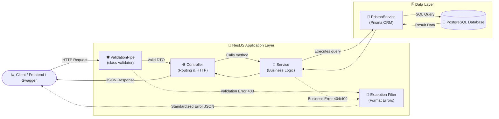
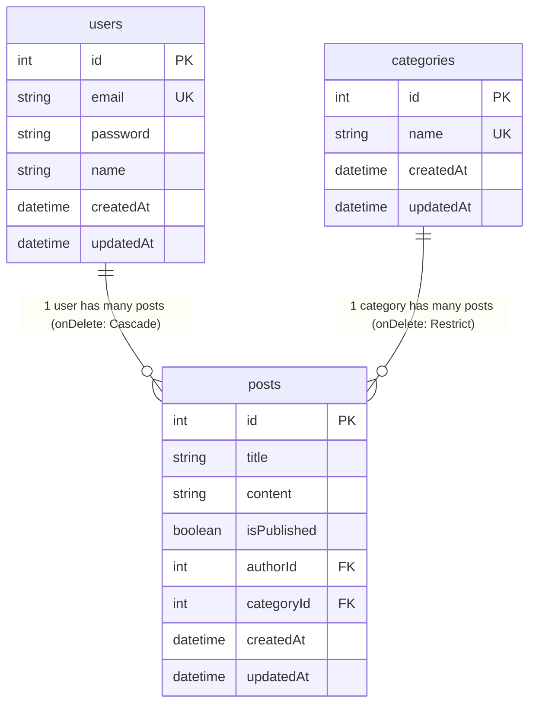

# 📰 NestJS + Prisma + PostgreSQL Blog CMS API

---

## 🌟 จุดเด่นของโปรเจกต์ (Key Features)

- ⚡ **NestJS 12 (TypeScript & ES Modules)**: สถาปัตยกรรมระดับองค์กร (Enterprise Architecture) ที่มีระเบียบและสเกลง่าย
- 🔒 **Authentication & JWT**: ระบบสมัครสมาชิก, เข้าสู่ระบบ และออก Access Token ด้วย Passport & JWT
- 🛡️ **Role-Based Access Control (RBAC)**: แบ่งระดับสิทธิ์ผู้ใช้เป็น `ADMIN` และ `AUTHOR` พร้อมระบบปกป้องความเป็นเจ้าของบทความ (Ownership Protection)
- 🔑 **Password Hashing (bcrypt)**: เข้ารหัสผ่านอย่างปลอดภัยก่อนบันทึกลง Database
- 🐘 **PostgreSQL & Prisma 6 ORM**: Data Modeling ที่มี Type-Safety สูงสุด พร้อมความสัมพันธ์แบบ 1-to-Many
- 🛡️ **DTO & Class Validation**: ป้องกันข้อมูลผิดพลาดและช่องโหว่ Mass Assignment ด้วย `class-validator`
- 🎯 **URI API Versioning**: รองรับทั้ง `/api/v1` (CRUD ปกติ) และ `/api/v2` (Pagination, Metrics, Analytics)
- 🚨 **Global Exception Filters**: ระบบดักจับ Error และแปลงเป็น JSON Format มาตรฐานเดียวกันทั้งระบบ
- 📚 **Swagger (OpenAPI) Documentation**: มี Interactive Web UI พร้อมปุ่ม **Authorize** สำหรับใส่ JWT Token
- 🐳 **One-Command Dev Environment**: สคริปต์เปิด Docker PostgreSQL + ซิงค์ Prisma Schema + รัน Server อัตโนมัติ

---

## 🏗️ สถาปัตยกรรมระบบ (System Architecture & Flow)

NestJS ทำงานตามหลักการ **Separation of Concerns (SoC)** โดยแบ่งหน้าที่อย่างชัดเจนในแต่ละชั้น:



---

## 🗄️ โครงสร้างฐานข้อมูล (Database Schema & Relations)



### 💡 Backend Concepts ในตารางนี้:
1. **Cascade Delete (`User -> Post`)**: เมื่อลบ User ผู้เขียน บทความทั้งหมดที่ผู้ใช้นี้เขียนจะถูกลบตามทันทีอัตโนมัติ
2. **Restrict Delete (`Category -> Post`)**: หากหมวดหมู่ยังมีบทความผูกอยู่ จะ**ไม่อนุญาตให้ลบ**หมวดหมู่นั้น เพื่อป้องกันปัญหาข้อมูลกำพร้า (Orphan Data)
3. **Database Indexing & Constraints**: กำหนด `email` และชื่อหมวดหมู่ `name` ให้เป็น `@unique` เพื่อให้ค้นหาได้รวดเร็วและป้องกันข้อมูลซ้ำซ้อนในระดับฐานข้อมูล

---

## 🎓 6 เสาหลักความรู้ Backend ในโปรเจกต์นี้ (Core Learning Concepts)

### 1. Controllers vs Services vs Modules
- **Controller**: รับ HTTP Request, อ่านค่าพารามิเตอร์ (`@Param`, `@Body`, `@Query`), และตอบกลับผลลัพธ์ **(ห้ามเขียน SQL หรือ Business Logic ที่นี่)**
- **Service**: ศูนย์รวม Business Logic เช่น การตรวจสอบว่าอีเมลซ้ำหรือไม่, การคำนวณระยะเวลาการอ่านบทความ
- **Module**: กำแพงล้อมขอบเขตของ Feature ช่วยจัดการการ Export/Import คลาสเพื่อนำไปใช้ซ้ำ

### 2. Dependency Injection (DI) & Inversion of Control (IoC)
แทนที่เราจะเขียน `const prisma = new PrismaClient()` ในทุกๆ ไฟล์ NestJS จะสร้าง Instance ของ `PrismaService` ให้เพียงครั้งเดียว (Singleton) แล้วส่ง (Inject) เข้ามาใน Constructor ของแต่ละ Service เอง ช่วยให้ Unit Test ง่ายขึ้นและประหยัด Resource

### 3. DTO (Data Transfer Object) & Input Validation
การรับ Request Body ต้องมีคลาส DTO รองรับเสมอ พร้อม Decorator ตรวจสอบ:
- `@IsEmail()`: ตรวจสอบความถูกต้องของรูปแบบอีเมล
- `@MinLength(6)`: บังคับความยาวขั้นต่ำ
- `@IsOptional()`: ใช้สำหรับการ Update ข้อมูลบางส่วน (PATCH)
- `@Type(() => Number)`: แปลง String เป็น Number อัตโนมัติ

### 4. Custom Global Exception Filters
เมื่อเกิด Error เราไม่ส่ง Raw Stacktrace ไปให้ผู้ใช้ แต่ดักจับด้วย Exception Filter เพื่อส่งกลับด้วยมาตรฐานเดียวกันเสมอ:
```json
{
  "statusCode": 400,
  "timestamp": "2026-09-29T12:00:00.000Z",
  "path": "/api/v1/users",
  "message": ["email must be an email"]
}
```

### 5. API Versioning (v1 vs v2)
เมื่อระบบโตขึ้น Business Requirement ย่อมเปลี่ยนไป แต่ระบบเดิม (Client เก่า) ยังต้องใช้งานได้:
- **Version 1 (`/api/v1/posts`)**: คืนค่าบทความทั้งหมดเป็น Array ก้อนเดียว เหมาะสำหรับเว็บขนาดเล็ก
- **Version 2 (`/api/v2/posts`)**: ปรับปรุงให้รองรับ **Pagination** (`?page=1&limit=10`), ค้นหา Keyword (`?search=...`), และส่งกลับพร้อม Pagination Metadata

### 6. Query Optimization with `Promise.all`
ใน v2 Posts Pagination เราต้องการทั้ง **จำนวนข้อมูลทั้งหมด (`count`)** และ **ข้อมูลของหน้านั้น (`findMany`)** แทนที่จะสั่งทำงานทีละคำสั่ง (Sequential) เราใช้ `Promise.all` สั่งให้ฐานข้อมูลประมวลผลพร้อมกันในระดับ Database ช่วยลด Response Time ลงได้กว่าครึ่ง!

---

## 📋 สรุป API Endpoints ทั้งหมด (API Reference)

### 🟢 Version 1 (`/api/v1`) — Standard CRUD

| Method | Endpoint | สิทธิ์การเข้าถึง (Access) | Description |
|---|---|---|---|
| `POST` | `/api/v1/auth/register` | Public | สมัครสมาชิกใหม่ (Register & get JWT) |
| `POST` | `/api/v1/auth/login` | Public | เข้าสู่ระบบ (Login & get JWT) |
| `GET` | `/api/v1/auth/profile` | 🔒 Authenticated | ดูโปรไฟล์ผู้ใช้ปัจจุบันจาก JWT |
| `POST` | `/api/v1/users` | Public | สร้างผู้ใช้งาน (Create user) |
| `GET` | `/api/v1/users` | Public | ดึงรายชื่อผู้ใช้ทั้งหมด (List all users) |
| `GET` | `/api/v1/users/:id` | Public | ดึงข้อมูลผู้ใช้รายบุคคลพร้อมบทความที่เขียน |
| `PATCH` | `/api/v1/users/:id` | Public | แก้ไขข้อมูลผู้ใช้ (Update user) |
| `DELETE` | `/api/v1/users/:id` | Public | ลบผู้ใช้ (Delete user & cascade posts) |
| `POST` | `/api/v1/categories` | 🛡️ **ADMIN only** | สร้างหมวดหมู่ใหม่ (Create category) |
| `GET` | `/api/v1/categories` | Public | ดึงหมวดหมู่ทั้งหมดพร้อมจำนวนบทความ (`_count`) |
| `GET` | `/api/v1/categories/:id` | Public | ดึงหมวดหมู่ตาม ID พร้อมบทความในหมวดหมู่ |
| `PATCH` | `/api/v1/categories/:id` | 🛡️ **ADMIN only** | แก้ไขชื่อหมวดหมู่ (Update category) |
| `DELETE` | `/api/v1/categories/:id` | 🛡️ **ADMIN only** | ลบหมวดหมู่ (Delete category - Restrict if has posts) |
| `POST` | `/api/v1/posts` | 🔒 **Authenticated** | สร้างบทความ (ผูก `authorId` จาก Token อัตโนมัติ) |
| `GET` | `/api/v1/posts` | Public | ดึงบทความทั้งหมดแบบ Flat Array |
| `GET` | `/api/v1/posts/published` | Public | ดึงเฉพาะบทความที่เผยแพร่แล้ว (`isPublished = true`) |
| `GET` | `/api/v1/posts/:id` | Public | ดึงบทความตาม ID พร้อมชื่อผู้เขียนและหมวดหมู่ |
| `PATCH` | `/api/v1/posts/:id` | 🔒 **Owner / Admin** | แก้ไขบทความ (ผู้เขียนเดิม หรือ Admin) |
| `DELETE` | `/api/v1/posts/:id` | 🔒 **Owner / Admin** | ลบบทความ (ผู้เขียนเดิม หรือ Admin) |

---

### 🚀 Version 2 (`/api/v2`) — Advanced Endpoints

| Method | Endpoint | Query Parameters | Description |
|---|---|---|---|
| `GET` | `/api/v2/posts` | `page`, `limit`, `search`, `categoryId` | คืนค่าบทความแบบแบ่งหน้า พร้อมการค้นหาและ Metadata |
| `GET` | `/api/v2/posts/stats` | - | สรุปสถิติบทความ (Total, Published, Drafts, Categories) |
| `GET` | `/api/v2/posts/:id` | - | ดึงบทความเดี่ยว พร้อมคำนวณเวลาอ่านและแนะนำบทความที่เกี่ยวข้อง |

#### ตัวอย่าง Response ของ `GET /api/v2/posts`:
```json
{
  "data": [
    {
      "id": 1,
      "title": "Getting Started with NestJS",
      "content": "...",
      "isPublished": true,
      "author": { "id": 1, "name": "John Doe", "email": "john@example.com" },
      "category": { "id": 1, "name": "Technology" }
    }
  ],
  "meta": {
    "total": 25,
    "page": 1,
    "limit": 10,
    "totalPages": 3,
    "hasNextPage": true,
    "hasPreviousPage": false
  }
}
```

---

## ⚡ วิธีติดตั้งและรันโปรเจกต์ (Getting Started)

### ความต้องการของระบบ (Prerequisites)
- [Node.js](https://nodejs.org/) (v18 หรือใหม่กว่า)
- [Docker Desktop](https://www.docker.com/) (สำหรับรัน PostgreSQL Container)

### ขั้นตอนการรัน

1. **Clone โปรเจกต์ และติดตั้ง Dependencies:**
   ```bash
   git clone <repo-url>
   cd nestjs-prisma-blog-api
   npm install
   ```

2. **เปิดโปรแกรม Docker Desktop** บนคอมพิวเตอร์ของคุณ

3. **สั่งรันระบบด้วยคำสั่งเดียว (All-in-one command):**
   ```bash
   npm run start:dev
   ```
   *สคริปต์จะตรวจสอบ Docker, สตาร์ท PostgreSQL Container บน Port 5433, รอจน Database พร้อม, ซิงค์ Prisma Schema, และเปิด NestJS Server แบบ Hot Reload ให้อัตโนมัติ!*

4. **เปิดดูเอกสารและทดสอบ API:**
   - 📚 **Swagger UI**: [http://localhost:3000/api/docs](http://localhost:3000/api/docs)
   - 🌐 **Base API URL**: [http://localhost:3000/api](http://localhost:3000/api)

---

## 🧪 การทำ Unit Testing ด้วย Vitest & Mocking

โปรเจกต์นี้ตั้งค่า **Unit Testing** ด้วย **Vitest** และ **`vitest-mock-extended`** ครบถ้วน:
- **Fast Execution**: รันเทสต์ได้เร็วมาก (เฉลี่ยไม่ถึง 0.5 วินาที)
- **Deep Mocking**: ใช้ `mockDeep<PrismaClient>()` จำลอง Database ทั้งหมด ทำให้ทดสอบได้โดยไม่ต้องเชื่อมต่อฐานข้อมูลจริง
- **AAA Pattern (Arrange - Act - Assert)**: โครงสร้างการเขียนเทสต์ที่เป็นระเบียบ อ่านง่าย

```bash
# 1. รัน Unit Test ทั้งหมด 35 ข้อ (Auth, RolesGuard, Categories, Users, Posts)
npm test

# 2. รัน Test แบบ Watch Mode (จะเทสต์ใหม่อัตโนมัติเมื่อแก้โค้ด)
npm run test:watch

# 3. รัน Test พร้อมดูรายงาน Code Coverage
npm run test:cov
```

---

## 🛠️ รายการคำสั่ง NPM Scripts (Useful Commands)

| Command | หน้าที่ |
|---|---|
| `npm run start:dev` | รัน Docker + Sync Schema + รัน NestJS Server ครบจบในคำสั่งเดียว |
| `npm run start:dev:only` | รันเฉพาะ NestJS Server (กรณีที่ Database รันอยู่แล้ว) |
| `npm run db:stop` | ปิด PostgreSQL Docker Container |
| `npm test` | รัน Unit Tests ทั้งหมดด้วย Vitest |
| `npm run test:watch` | รัน Unit Tests แบบโหมด Watch (Hot Reload Tests) |
| `npm run test:cov` | ตรวจสอบ Code Coverage รายงานเปอร์เซ็นต์โค้ดที่ถูกทดสอบ |
| `npx prisma studio` | เปิด Web GUI ดูและจัดการข้อมูลใน Database ด้วย Prisma Studio |
| `npx prisma db push` | ซิงค์ Schema จาก `schema.prisma` ไปยัง Database โดยตรง |
| `npm run build` | คอมไพล์โปรเจกต์ TypeScript เป็น JavaScript ในโฟลเดอร์ `dist/` |

---

## 🗺️ เส้นทางพัฒนาต่อยอดสู่ Senior Backend (Next Steps for Career Growth)

เพื่อยกระดับโปรเจกต์นี้ให้พร้อมสำหรับ Production ระดับสูง ลองเพิ่มฟีเจอร์เหล่านี้:
1. **Authentication & Authorization**: ติดตั้ง `@nestjs/jwt` และ `passport` เพื่อทำระบบ Login, Register, และ Role-Based Access Control (Admin vs Author)
2. **Password Hashing**: ใช้ `bcrypt` เข้ารหัสผ่านก่อนบันทึกลงฟิลด์ `password` ในฐานข้อมูล
3. **Caching with Redis**: แคชผลลัพธ์ของ `GET /api/v2/posts` ด้วย Redis เพื่อลดภาระการคิวรีฐานข้อมูล
4. **File Uploads**: รองรับการอัปโหลดรูปภาพหน้าปกบทความ (Cover Image) ไปยัง AWS S3 หรือ Cloudinary
5. **Unit & E2E Testing**: เขียน Integration Test ด้วย Vitest และ Supertest เพื่อการันตีคุณภาพของโค้ด
