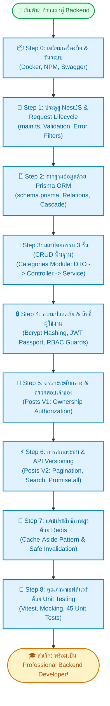

# 🗺️ Roadmap การเรียนรู้สู่ Backend Developer (Learning Path)
*แผนที่นำทางทีละขั้นตอน (Step-by-Step Guide) เพื่อสำรวจ ทำความเข้าใจ และฝึกฝนโค้ดในโปรเจกต์นี้ตั้งแต่ศูนย์จนเชี่ยวชาญ*

---

## 🎯 ภาพรวมเส้นทางการเรียนรู้ (Visual Learning Flow)



---

## 📌 ขั้นตอนการสำรวจและเรียนรู้แบบเจาะลึก (Step-by-Step Learning)

### 📦 Step 0: เตรียมเครื่องมือ & รันระบบ (Environment & Infrastructure)
**เป้าหมาย**: เข้าใจวิธีการที่ระบบ Backend เชื่อมต่อกับ Container ภายนอก และทดลองยิง API ครั้งแรก

- 📂 **ไฟล์ที่ต้องเปิดดู**:
  1. [`scripts/start-dev.sh`](../scripts/start-dev.sh) - สคริปต์ Bash อัตโนมัติที่สั่งเช็ค Docker, รัน Postgres (Port 5433) และ Redis (Port 6379) พร้อมทั้งสั่งซิงค์ Database Schema
  2. [`.env.example`](../.env.example) - ตัวแปร Configuration ต่างๆ ที่จำเป็นต่อระบบ
  3. [`package.json`](../package.json) - ดู scripts ต่างๆ เช่น `npm run start:dev`, `npm test`, `npm run db:stop`
- 🧪 **การทดลองทำจริง (Action)**:
  ```bash
  npm run start:dev
  ```
  เปิดเบราว์เซอร์ไปที่ [http://localhost:3000/api/docs](http://localhost:3000/api/docs) เพื่อดู Swagger UI และลองกดเล่น API สัก 1-2 ตัว

---

### 🚪 Step 1: ประตูสู่ NestJS & Request Lifecycle (การเดินทางของ Request)
**เป้าหมาย**: เข้าใจว่าเมื่อ Client ส่ง HTTP Request เข้ามา เกิดอะไรขึ้นบ้างก่อนจะถึงโค้ดของเรา

- 📂 **ไฟล์ที่ต้องเปิดดู**:
  1. [`src/main.ts`](../src/main.ts) - จุดเริ่มต้นของแอป (Bootstrap): ดูการเปิดใช้งาน `setGlobalPrefix('api')`, `enableVersioning`, `ValidationPipe`, และ `SwaggerModule`
  2. [`src/common/filters/http-exception.filter.ts`](../src/common/filters/http-exception.filter.ts) - ตัวแปลง Error มาตรฐาน
  3. [`src/common/filters/all-exceptions.filter.ts`](../src/common/filters/all-exceptions.filter.ts) - ตัวดักจับ Unexpected 500 Errors
- 💡 **สิ่งที่ต้องเข้าใจให้ได้**:
  - ทำไมต้องมี `ValidationPipe({ whitelist: true })`? (เพื่อป้องกันช่องโหว่ Mass Assignment)
  - ทำไมลำดับการวาง Global Filters ใน `main.ts` ถึงสำคัญมาก?

---

### 🗄️ Step 2: รากฐานข้อมูลด้วย Prisma ORM (Data Modeling & Relations)
**เป้าหมาย**: เข้าใจการออกแบบโครงสร้างตารางและความสัมพันธ์แบบ Type-Safe

- 📂 **ไฟล์ที่ต้องเปิดดู**:
  1. [`prisma/schema.prisma`](../prisma/schema.prisma) - โมเดล `User`, `Category`, `Post`, และ Enum `Role`
  2. [`src/prisma/prisma.service.ts`](../src/prisma/prisma.service.ts) - คลาสเชื่อมต่อฐานข้อมูลที่ขยายมาจาก `PrismaClient`
- 💡 **สิ่งที่ต้องเข้าใจให้ได้**:
  - ความแตกต่างระหว่าง `onDelete: Cascade` (ใน User -> Post) กับ `onDelete: Restrict` (ใน Category -> Post)
  - ทำไมต้องมี `PrismaService` ห่อหุ้ม `PrismaClient` อีกชั้นใน NestJS? (เพื่อให้ NestJS จัดการ Lifecycle และทำ Dependency Injection ได้)

---

### 🧱 Step 3: สถาปัตยกรรม 3 ชั้น (Categories Module - Classic CRUD)
**เป้าหมาย**: เรียนรู้ Flow พื้นฐานของ Backend: DTO -> Controller -> Service -> Database

- 📂 **ไฟล์ที่ต้องเปิดดูตามลำดับ**:
  1. [`src/categories/dto/create-category.dto.ts`](../src/categories/dto/create-category.dto.ts) - การเขียน Class Validator ป้องกันข้อมูลขยะ
  2. [`src/categories/categories.controller.ts`](../src/categories/categories.controller.ts) - ดูวิธีรับ HTTP (`@Get`, `@Post`), พารามิเตอร์ (`@Body`, `@Param`) และ Decorator ของ Swagger
  3. [`src/categories/categories.service.ts`](../src/categories/categories.service.ts) - ดูการเขียน Business Logic และการเช็ค `findUnique` ป้องกันชื่อหมวดหมู่ซ้ำ
  4. [`src/categories/categories.module.ts`](../src/categories/categories.module.ts) - ดูการผูก Controller เข้ากับ Provider (Service)
- 💡 **สิ่งที่ต้องเข้าใจให้ได้**:
  - ทำไมเราถึง**ห้าม**เขียนคำสั่งคิวรี Database ใน Controller?
  - ทำไมต้องมี DTO แยกไฟล์ระหว่าง Create และ Update?

---

### 🔒 Step 4: ความปลอดภัย & สิทธิ์ผู้ใช้งาน (Authentication & RBAC)
**เป้าหมาย**: เข้าใจระบบความปลอดภัยระดับสากล การออกตั๋ว JWT และการล็อกประตู Endpoints

- 📂 **ไฟล์ที่ต้องเปิดดูตามลำดับ**:
  1. [`src/auth/auth.service.ts`](../src/auth/auth.service.ts) - ดูการใช้ `bcrypt.hash` ในการสมัครสมาชิก และ `bcrypt.compare` + `jwtService.sign` ในการ Login
  2. [`src/auth/strategies/jwt.strategy.ts`](../src/auth/strategies/jwt.strategy.ts) - Passport Strategy ที่ถอดรหัส Token และดึง User มาใส่ใน `req.user`
  3. [`src/auth/guards/roles.guard.ts`](../src/auth/guards/roles.guard.ts) - Guard ที่ดึง Metadata จาก `@Roles()` มาตรวจสอบว่าสิทธิ์ของผู้ใช้ผ่านเกณฑ์หรือไม่
  4. [`src/common/decorators/current-user.decorator.ts`](../src/common/decorators/current-user.decorator.ts) - Custom Parameter Decorator สำหรับดึง user ออกมาจาก request อย่างสะอาดตา
- 💡 **สิ่งที่ต้องเข้าใจให้ได้**:
  - ทำไมเราถึงไม่เก็บ Password ใน Database เป็นตัวอักษรธรรมดา (Plain text)?
  - Token มีข้อมูลอะไรข้างในบ้าง (Payload)? และทำไมจึงไม่ควรเก็บรหัสผ่านไว้ใน JWT Token?

---

### 📝 Step 5: ตรรกะระดับกลาง & ตรวจสอบเจ้าของ (Posts Module - V1 CRUD)
**เป้าหมาย**: เรียนรู้การผูกข้อมูลอัตโนมัติจาก Token และการทำ Ownership Authorization

- 📂 **ไฟล์ที่ต้องเปิดดู**:
  1. [`src/posts/posts.controller.ts`](../src/posts/posts.controller.ts) - ดูการใช้ `@UseGuards(JwtAuthGuard)` และการส่ง `@CurrentUser()` เข้า Service
  2. [`src/posts/posts.service.ts`](../src/posts/posts.service.ts) - ดูฟังก์ชัน `create`, `update`, `remove`
- 💡 **สิ่งที่ต้องเข้าใจให้ได้**:
  - ทำไม Client ไม่ต้องส่ง `authorId` มาใน Body ตอนสร้างบทความ? (ระบบอ่านจาก Token ป้องกันการสวมรอย)
  - ในฟังก์ชัน `update` และ `remove` โค้ดตรวจสอบอย่างไรให้ Admin แก้ไขได้ทุกคน แต่ Author แก้ได้เฉพาะโพสต์ของตัวเอง?

---

### ⚡ Step 6: การสเกลระบบ & API Versioning (Posts Module - V2)
**เป้าหมาย**: เรียนรู้เทคนิคการรับมือกับข้อมูลขนาดใหญ่ (Big Data / High Traffic)

- 📂 **ไฟล์ที่ต้องเปิดดู**:
  1. [`src/posts/posts-v2.controller.ts`](../src/posts/posts-v2.controller.ts) - Controller ของ Version 2
  2. [`src/posts/dto/query-post-v2.dto.ts`](../src/posts/dto/query-post-v2.dto.ts) - DTO รองรับ Query Parameters (`page`, `limit`, `search`, `categoryId`)
  3. [`src/posts/posts.service.ts`](../src/posts/posts.service.ts) (ดูเมธอด `findAllV2`, `findOneV2`, `getStatsV2`)
- 💡 **สิ่งที่ต้องเข้าใจให้ได้**:
  - ทำไมระบบขนาดใหญ่จึงห้ามใช้ `findAll` แบบ v1 (คืนค่าทั้งหมด)?
  - ทำไมต้องใช้ `skip: (page - 1) * limit` และ `take: limit`?
  - ทำไมต้องใช้ `Promise.all([count, findMany])` แทนที่จะ `await` ทีละบรรทัด?
  - ทำไมต้องวาง `@Get('stats')` ไว้ก่อนหน้า `@Get(':id')`? (Route Precedence)

---

### 🚀 Step 7: แคชประสิทธิภาพสูงด้วย Redis (Caching & Invalidation)
**เป้าหมาย**: เข้าใจการทำ In-Memory Data Caching เพื่อลดภาระของฐานข้อมูลลง 90%+

- 📂 **ไฟล์ที่ต้องเปิดดู**:
  1. [`src/redis/redis.service.ts`](../src/redis/redis.service.ts) - Wrapper สำหรับ ioredis พร้อมเมธอด `get`, `set`, `del`, `delByPattern`
  2. [`src/redis/redis.module.ts`](../src/redis/redis.module.ts) - การทำ `@Global()` Module ใน NestJS
  3. [`src/posts/posts.service.ts`](../src/posts/posts.service.ts) - ดูส่วนของ Cache Hit/Miss ใน `findAllV2` และการล้างแคชใน `create/update/remove`
- 💡 **สิ่งที่ต้องเข้าใจให้ได้**:
  - **Cache-Aside Pattern**: ลำดับการเช็คแคชก่อนคิวรี Database ทำงานอย่างไร?
  - ทำไมใน Production จึง**ห้ามใช้คำสั่ง `KEYS *` เด็ดขาด**? และทำไมต้องใช้ `scanStream` แทน?
  - การทำ **Cache Invalidation** จำเป็นอย่างไรเมื่อข้อมูลมีการเปลี่ยนแปลง?

---

### 🧪 Step 8: คุณภาพซอฟต์แวร์ด้วย Unit Testing (Automated Tests with Vitest)
**เป้าหมาย**: เขียน Automated Test เป็น ไม่ต้องพึ่งพาการทดสอบด้วยมือ (Manual Testing) ตลอดเวลา

- 📂 **ไฟล์ที่ต้องเปิดดู**:
  1. [`vitest.config.ts`](../vitest.config.ts) - การตั้งค่า Vitest ใน NestJS
  2. [`src/categories/categories.service.spec.ts`](../src/categories/categories.service.spec.ts) - ตัวอย่าง Mocking ฐานข้อมูลด้วย `vitest-mock-extended`
  3. [`src/auth/guards/roles.guard.spec.ts`](../src/auth/guards/roles.guard.spec.ts) - ตัวอย่างการ Mock `ExecutionContext` และ `Reflector`
  4. [`src/posts/posts.service.spec.ts`](../src/posts/posts.service.spec.ts) - การทดสอบครอบคลุมทั้ง Database, Ownership, Cache Hit, Cache Miss และ Invalidation
  5. [`src/redis/redis.service.spec.ts`](../src/redis/redis.service.spec.ts) - การทดสอบ Redis Service
- 💡 **สิ่งที่ต้องเข้าใจให้ได้**:
  - โครงสร้าง **AAA (Arrange - Act - Assert)** คืออะไร?
  - ทำไมการใช้ `mockDeep<PrismaClient>()` ถึงทำให้ Unit Test รันได้เร็วมาก (น้อยกว่า 1 วินาที)?

---

## 🏆 Checklist ประเมินตนเอง (Self-Assessment Checklist)

ทำเครื่องหมาย `[x]` เมื่อคุณเข้าใจหัวข้อนั้นๆ อย่างถ่องแท้:

- [ ] **Docker & Setup**: รัน Docker container และอธิบายได้ว่า port 5433 กับ 6379 ใช้งานอย่างไร
- [ ] **NestJS Architecture**: อธิบายความแตกต่างระหว่าง Controller, Service, Module, และ DTO ได้
- [ ] **Validation**: เข้าใจการทำงานของ `class-validator` และ `ValidationPipe`
- [ ] **Prisma ORM**: เขียน Schema, กำหนดความสัมพันธ์ 1-to-many, และอธิบาย Cascade vs Restrict ได้
- [ ] **Authentication**: อธิบายการไหลของข้อมูลตอน Login -> ออก JWT -> ส่ง Bearer Token -> ผ่าน JwtStrategy ได้
- [ ] **Authorization**: อธิบายความแตกต่างระหว่าง Role-Based (Admin/Author) กับ Resource-Based (Ownership) ได้
- [ ] **Optimization**: อธิบายหลักการแบ่งหน้า (Pagination) และประโยชน์ของ `Promise.all` ได้
- [ ] **Redis Caching**: อธิบาย Cache-Aside Pattern, TTL, และเหตุผลที่ห้ามใช้ `KEYS *` ใน Production ได้
- [ ] **Unit Testing**: อธิบายหลักการ Mocking และรัน `npm test` ผ่านทั้ง 45 ข้อได้

---

## 🚀 ความท้าทายเพื่อฝึกฝนต่อยอด (Hands-On Challenges)

หากเรียนรู้ครบถ้วนแล้วและต้องการท้าทายตนเอง ลองพัฒนาต่อยอดด้วยโจทย์เหล่านี้:

1. **เพิ่มฟีเจอร์ Tag System**:
   - เพิ่ม Model `Tag` ใน `prisma/schema.prisma`
   - ทำความสัมพันธ์แบบ Many-to-Many (`Post` <-> `Tag`)
   - อัปเดต DTO และ Service ให้สามารถผูก Tag กับบทความได้
2. **เพิ่มระบบ Like บทความ**:
   - สร้าง Model `PostLike` (`userId`, `postId`) แบบ Composite Primary Key เพื่อกันการ Like ซ้ำ
   - สร้าง Endpoint `POST /api/v1/posts/:id/like`
3. **ระบบแคชสำหรับ Tag**:
   - นำ `RedisService` ไปแคชรายการสถิติ Tag ยอดนิยม
