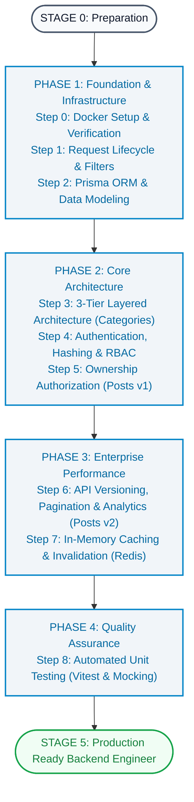

# Learning Roadmap: From Zero to Backend Developer
*แผนที่นำทางแบบทีละขั้นตอน (Step-by-Step Guide) เพื่อสำรวจ ทำความเข้าใจ และฝึกฝนโค้ดในโปรเจกต์นี้ตั้งแต่ศูนย์จนพร้อมทำงานจริง*

---

## Visual Learning Pipeline



---

## Step-by-Step Learning Walkthrough

### [STEP 0] Environment & Infrastructure Setup
* **[GOAL]**: ทำความเข้าใจว่า NestJS เชื่อมต่อกับ Docker Container ภายนอกอย่างไร และทดสอบรันระบบครั้งแรก
* **[SOURCE FILES]**:
  1. [`scripts/start-dev.sh`](../scripts/start-dev.sh) - สคริปต์อัตโนมัติตรวจสอบ Docker, รัน Postgres (Port 5433) และ Redis (Port 6379) พร้อมซิงค์ Prisma Schema
  2. [`.env.example`](../.env.example) - ตัวแปร Configuration ที่จำเป็นของระบบ
  3. [`package.json`](../package.json) - Scripts คำสั่งต่างๆ เช่น `start:dev`, `test`, `db:stop`
* **[KEY ARCHITECTURAL CONCEPTS]**:
  - ทำไมต้องแยก Host Port ของ PostgreSQL เป็น `5433` (เพื่อไม่ให้ชนกับ Local Postgres บน Port `5432`)
  - กลไก Healthcheck รอจนกระทั่ง Database และ Redis ตอบ `PONG` ก่อนเริ่มรัน Server
* **[HANDS-ON ACTION]**:
  ```bash
  npm run start:dev
  ```
  เปิดเบราว์เซอร์ไปที่ [http://localhost:3000/api/docs](http://localhost:3000/api/docs) เพื่อดู Swagger UI และทดลองยิง API

---

### [STEP 1] Request Lifecycle & Global Filters
* **[GOAL]**: เข้าใจการเดินทางของ HTTP Request ตั้งแต่เข้ามายัง Server จนถึง Controller
* **[SOURCE FILES]**:
  1. [`src/main.ts`](../src/main.ts) - จุดเริ่มต้นของแอปพลิเคชัน (Bootstrap): การเปิดใช้ `setGlobalPrefix('api')`, `enableVersioning`, `ValidationPipe` และ Swagger
  2. [`src/common/filters/http-exception.filter.ts`](../src/common/filters/http-exception.filter.ts) - ตัวแปลง HTTP Exception เป็น Standard JSON Format
  3. [`src/common/filters/all-exceptions.filter.ts`](../src/common/filters/all-exceptions.filter.ts) - ตัวดักจับ Unhandled Errors (500 Internal Server Error)
* **[KEY ARCHITECTURAL CONCEPTS]**:
  - ทำไมต้องตั้งค่า `ValidationPipe({ whitelist: true, forbidNonWhitelisted: true })` เพื่อป้องกันช่องโหว่ Mass Assignment
  - ลำดับความสำคัญในการลงทะเบียน Global Filters: Filter เฉพาะเจาะจงต้องมาก่อน Filter กว้างๆ
* **[CHECKPOINT]**:
  - อธิบายได้ว่าถ้า Client ส่งฟิลด์แปลกปลอมเข้ามา ระบบจะตอบสนองอย่างไร

---

### [STEP 2] Prisma ORM & Data Modeling
* **[GOAL]**: เข้าใจการออกแบบ Schema ความสัมพันธ์แบบ 1-to-Many, การทำ Soft Delete และข้อกำหนด Referential Integrity
* **[SOURCE FILES]**:
  1. [`prisma/schema.prisma`](../prisma/schema.prisma) - นิยามตาราง `users`, `categories`, `posts`, ฟิลด์ `deletedAt` พร้อม Index และ Enum `Role`
  2. [`src/prisma/prisma.service.ts`](../src/prisma/prisma.service.ts) - Singleton Wrapper ห่อหุ้ม `PrismaClient` ภายใต้ NestJS Lifecycle
* **[KEY ARCHITECTURAL CONCEPTS]**:
  - ความแตกต่างระหว่าง **Hard Delete** (ลบถาวรจาก Disk) กับ **Soft Delete** (`deletedAt DateTime?` + B-Tree Index)
  - ทำไม DB `onDelete: Cascade` ไม่ทำงานบน Soft Delete และทำไมต้องใช้ **Prisma `$transaction`** ทำ Application-Level Soft Cascade
  - การกำหนด Unique Index บนคอลัมน์ `email` และ `name` เพื่อความรวดเร็วและป้องกันข้อมูลซ้ำ
* **[CHECKPOINT]**:
  - อธิบายได้ว่าทำไมการ Soft Delete User จึงต้องสั่งมาร์กบทความของผู้ใช้คนนั้นให้เป็น Soft Delete ภายใต้ `$transaction` ในระดับ Service

---

### [STEP 3] 3-Tier Layered Architecture (Categories Module)
* **[GOAL]**: เรียนรู้ Flow พื้นฐานของ Backend: DTO -> Controller -> Service -> Database ผ่านโมดูล CRUD ที่เข้าใจง่ายที่สุด
* **[SOURCE FILES]**:
  1. [`src/categories/dto/create-category.dto.ts`](../src/categories/dto/create-category.dto.ts) - การใช้ class-validator กำหนดเงื่อนไขข้อมูลนำเข้า
  2. [`src/categories/categories.controller.ts`](../src/categories/categories.controller.ts) - การรับ HTTP Method (`@Get`, `@Post`), พารามิเตอร์ (`@Body`, `@Param`) และ Swagger Decorators
  3. [`src/categories/categories.service.ts`](../src/categories/categories.service.ts) - การเขียน Business Logic, การเช็คชื่อซ้ำ, Soft Restrict Delete, และการดึงข้อมูลพร้อม `_count`
  4. [`src/categories/categories.module.ts`](../src/categories/categories.module.ts) - การรวม Controller และ Provider เข้าเป็น Feature Module
* **[KEY ARCHITECTURAL CONCEPTS]**:
  - กฎเหล็ก: ห้ามเขียนคำสั่ง Database Query ใน Controller เด็ดขาด
  - Separation of Concerns: Controller จัดการ HTTP Routing ส่วน Service จัดการ Business Rules
  - Soft Restrict Pattern: ตรวจสอบจำนวน Active Posts ก่อนอนุญาตให้ Soft Delete Category
* **[CHECKPOINT]**:
  - อธิบายการทำงานของ Dependency Injection ที่ส่ง `PrismaService` เข้าสู่ `CategoriesService`

---

### [STEP 4] Authentication, Hashing & Role-Based Access Control
* **[GOAL]**: เข้าใจกลไกการรักษาความปลอดภัย การเข้ารหัสผ่าน การออก Token และการจำกัดสิทธิ์ Endpoint
* **[SOURCE FILES]**:
  1. [`src/auth/auth.service.ts`](../src/auth/auth.service.ts) - การใช้ `bcrypt.hash` ตอนสมัครสมาชิก และ `bcrypt.compare` + `jwtService.sign` ตอนเข้าสู่ระบบ (กรองเฉพาะ Active Users)
  2. [`src/auth/strategies/jwt.strategy.ts`](../src/auth/strategies/jwt.strategy.ts) - Passport Strategy สกัด Bearer Token ตรวจสอบสถานะ User และดึง Profile มาเก็บใน `req.user`
  3. [`src/auth/guards/roles.guard.ts`](../src/auth/guards/roles.guard.ts) - Guard ตรวจสอบ Metadata จาก `@Roles()` กับ Role ของผู้ใช้ปัจจุบัน
  4. [`src/auth/decorators/current-user.decorator.ts`](../src/auth/decorators/current-user.decorator.ts) - Custom Parameter Decorator ดึง User สะอาดตา
* **[KEY ARCHITECTURAL CONCEPTS]**:
  - ข้อแตกต่างระหว่าง Authentication (ระบุตัวตน) กับ Authorization (ตรวจสอบสิทธิ์)
  - ทำไมผู้ใช้ที่ถูก Soft Delete ไปแล้ว จึงต้องถูกปฏิเสธทั้งการ Login และการยิง Request ผ่าน JWT
* **[CHECKPOINT]**:
  - สามารถไล่ Flow ได้ตั้งแต่ Client ยิง Login -> ได้รับ Token -> แนบ Header `Authorization: Bearer <token>` -> Guard อนุญาตให้เข้าถึง

---

### [STEP 5] Ownership Authorization & Soft Delete (Posts Module v1)
* **[GOAL]**: เรียนรู้การผูกข้อมูลจาก Token อัตโนมัติ, การทำ Resource-Based Ownership Check และ Soft Delete Pattern
* **[SOURCE FILES]**:
  1. [`src/posts/posts.controller.ts`](../src/posts/posts.controller.ts) - การป้องกัน Route ด้วย `@UseGuards(JwtAuthGuard)` และส่ง `@CurrentUser()` เข้า Service
  2. [`src/posts/posts.service.ts`](../src/posts/posts.service.ts) - เมธอด `create`, `update`, `remove` (Soft Delete ด้วย `deletedAt: new Date()`)
* **[KEY ARCHITECTURAL CONCEPTS]**:
  - ผู้ใช้ไม่ต้องส่ง `authorId` มาใน Body ตอนสร้างบทความ ระบบดึงจาก JWT ป้องกันการสวมรอย
  - ในคำสั่ง `update` และ `remove`: ADMIN แก้ไข/ลบได้ทุกบทความ ส่วน AUTHOR แก้ไข/ลบได้เฉพาะบทความที่ตนเองเป็นเจ้าของ
  - ในคำสั่ง `remove`: ใช้ Soft Delete บันทึก `deletedAt = NOW()` และสั่งล้าง Redis Cache ทันที
* **[CHECKPOINT]**:
  - อธิบายเงื่อนไข if-else ที่ใช้ตรวจสอบสิทธิ์ใน `update()` และ `remove()` และผลกระทบต่อ Redis Cache

---

### [STEP 6] API Versioning, Pagination & Performance (Posts Module v2)
* **[GOAL]**: ศึกษาวิธีการสเกลระบบเพื่อรับมือกับข้อมูลขนาดใหญ่ และการออกแบบ Versioning
* **[SOURCE FILES]**:
  1. [`src/posts/posts-v2.controller.ts`](../src/posts/posts-v2.controller.ts) - Controller ของ Version 2
  2. [`src/posts/dto/query-post-v2.dto.ts`](../src/posts/dto/query-post-v2.dto.ts) - DTO รองรับ Query Parameters (`page`, `limit`, `search`, `categoryId`)
  3. [`src/posts/posts.service.ts`](../src/posts/posts.service.ts) - เมธอด `findAllV2`, `findOneV2`, `getStatsV2`
* **[KEY ARCHITECTURAL CONCEPTS]**:
  - ทำไมระบบ Production ขนาดใหญ่ห้ามคืนค่า Flat Array ทั้งหมด (ป้องกัน Memory Exhaustion)
  - การใช้ `skip` และ `take` ทำ Database Pagination ร่วมกับ Metadata
  - การใช้ `Promise.all([count, findMany])` เพื่อประมวลผลพร้อมกันในระดับ Database
  - กฎสำคัญของ Route Precedence: Static Route (`@Get('stats')`) ต้องอยู่ก่อน Dynamic Route (`@Get(':id')`)
* **[CHECKPOINT]**:
  - อธิบายผลลัพธ์ที่จะเกิดขึ้นหากวาง `@Get(':id')` ไว้ก่อนหน้า `@Get('stats')`

---

### [STEP 7] In-Memory Caching & Safe Invalidation (Redis)
* **[GOAL]**: เข้าใจกลยุทธ์การทำ In-Memory Caching เพื่อลดภาระ Database และเพิ่มความเร็วในการตอบสนองระดับต่ำกว่า 5ms
* **[SOURCE FILES]**:
  1. [`src/redis/redis.service.ts`](../src/redis/redis.service.ts) - In-Memory Wrapper รองรับ `get`, `set`, `del`, `delByPattern`
  2. [`src/redis/redis.module.ts`](../src/redis/redis.module.ts) - การสร้าง `@Global()` Module ใน NestJS
  3. [`src/posts/posts.service.ts`](../src/posts/posts.service.ts) - กลยุทธ์ Cache-Aside ใน `findAllV2` และ Invalidation ใน `create`, `update`, `remove`
* **[KEY ARCHITECTURAL CONCEPTS]**:
  - **Cache-Aside Pattern (Lazy Loading)**: เช็คแคชก่อน หากมีข้อมูล (Hit) คืนค่าทันที หากไม่มี (Miss) ดึง DB แล้วเซฟลงแคชพร้อม TTL (60s)
  - **Non-blocking Invalidation**: ทำไมต้องใช้ `scanStream` แทนคำสั่ง `KEYS *` (ป้องกันการบล็อก Redis Single-Threaded Event Loop)
* **[CHECKPOINT]**:
  - อธิบายคำสั่งที่เกิดขึ้นใน Redis เมื่อมีการสร้างโพสต์ใหม่

---

### [STEP 8] Automated Unit Testing & Deep Mocking (Vitest)
* **[GOAL]**: ฝึกฝนการเขียน Automated Tests และการจำลองระบบภายนอกด้วย Deep Mocking
* **[SOURCE FILES]**:
  1. [`vitest.config.ts`](../vitest.config.ts) - การตั้งค่า Vitest ในโปรเจกต์ NestJS
  2. [`src/categories/categories.service.spec.ts`](../src/categories/categories.service.spec.ts) - การ Mock Prisma Client ทดสอบ Soft Delete และ Soft Restrict
  3. [`src/auth/guards/roles.guard.spec.ts`](../src/auth/guards/roles.guard.spec.ts) - การ Mock `ExecutionContext` และ `Reflector`
  4. [`src/posts/posts.service.spec.ts`](../src/posts/posts.service.spec.ts) - การทดสอบครอบคลุม Soft Delete, Ownership, Cache Hit, Cache Miss, Invalidation
  5. [`src/users/users.service.spec.ts`](../src/users/users.service.spec.ts) - การทดสอบ Soft Cascade Transaction
  6. [`src/redis/redis.service.spec.ts`](../src/redis/redis.service.spec.ts) - การทดสอบ Redis Service และ Non-blocking Stream
* **[KEY ARCHITECTURAL CONCEPTS]**:
  - โครงสร้าง AAA (Arrange - Act - Assert)
  - ประโยชน์ของ In-Memory Mocking: เทสต์รันได้รวดเร็ว (< 1 วินาที) โดยไม่ต้องเปิด Docker หรือต่อ Network จริง
* **[CHECKPOINT]**:
  - รัน `npm test` และยืนยันว่าการทดสอบทั้ง 47 ข้อผ่านทั้งหมด 100%

---

## Self-Assessment Matrix

| Competency Area | Essential Knowledge Checklist | Status |
|---|---|:---:|
| **Infrastructure** | สามารถรัน Docker Compose / Start script และอธิบาย Port 5433 และ 6379 ได้ | [ ] |
| **Architecture** | อธิบายบทบาทหน้าที่ที่แตกต่างกันของ Controller, Service, Module, DTO ได้ | [ ] |
| **Validation** | เข้าใจการทำงานของ `class-validator`, `ValidationPipe` และการป้องกัน Mass Assignment | [ ] |
| **ORM & Relational DB** | ออกแบบ Schema, ความสัมพันธ์ 1-to-Many, และอธิบาย Cascade vs Restrict ได้ | [ ] |
| **Soft Delete & Integrity** | อธิบายความต่างระหว่าง Hard vs Soft Delete รวมถึงการทำ Soft Cascade ด้วย `$transaction` และ Soft Restrict ได้ | [ ] |
| **Authentication** | อธิบายการไหลของข้อมูลตอน Login -> Bcrypt Verify -> Sign JWT -> Bearer Token ได้ | [ ] |
| **Authorization** | อธิบายความต่างระหว่าง Role-Based (Admin/Author) กับ Resource Ownership ได้ | [ ] |
| **Performance** | อธิบายหลักการ Pagination, Concurrency ด้วย `Promise.all` ได้ | [ ] |
| **Caching** | อธิบาย Cache-Aside, TTL, และเหตุผลที่ห้ามใช้ `KEYS *` ใน Production ได้ | [ ] |
| **Software Quality** | อธิบายหลักการ Deep Mocking และรัน Unit Test 47 ข้อผ่านครบถ้วนได้ | [ ] |

---

## Practical Challenges for Mastery

เมื่อศึกษาจนครบถ้วนแล้ว ให้ลองพัฒนาฟีเจอร์เหล่านี้ต่อยอดด้วยตนเอง:

| Challenge | Requirements | Architectural Focus |
|---|---|---|
| **Challenge 1: Tagging System** | เพิ่ม Model `Tag` ใน `schema.prisma` ทำความสัมพันธ์ Many-to-Many กับ `Post` | Schema Relations, Nested Writes, Validation |
| **Challenge 2: Post Likes Counter** | เพิ่ม Model `PostLike` พร้อม Composite Key (`userId`, `postId`) ป้องกันการกดซ้ำ | Composite Keys, Unique Constraints, Transaction |
| **Challenge 3: Tag Caching** | นำ `RedisService` ไปแคชผลลัพธ์ของ Tag ยอดนิยม | In-Memory Caching, Cache Invalidation Strategy |
