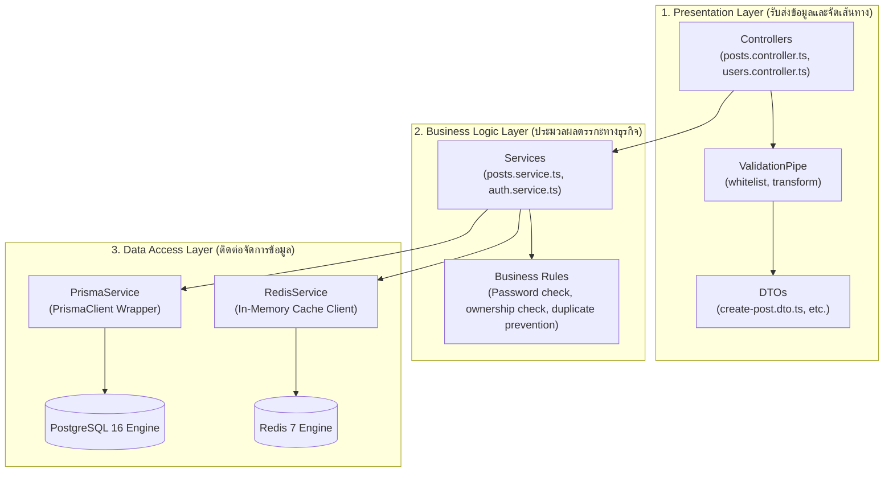
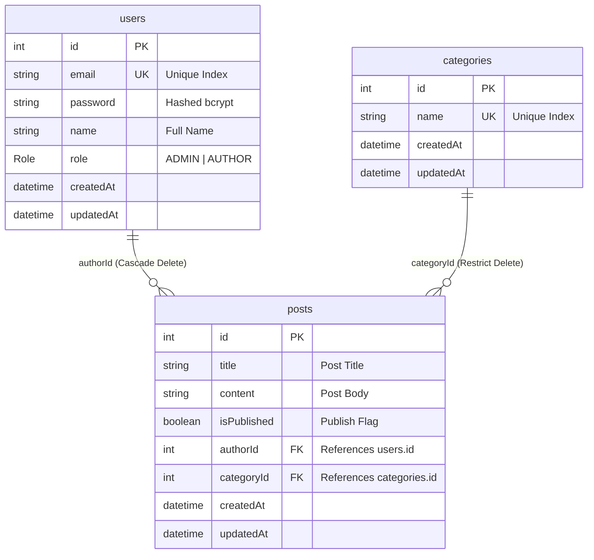
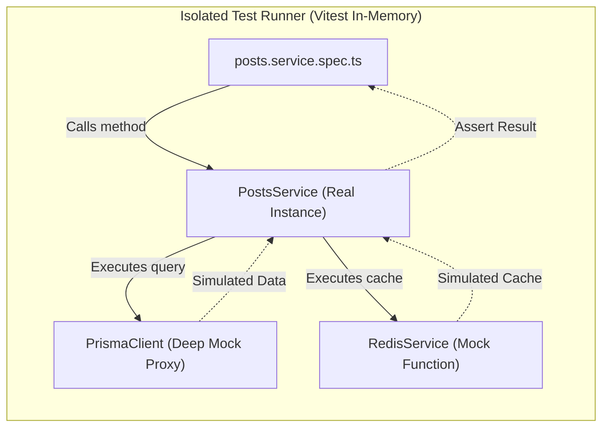
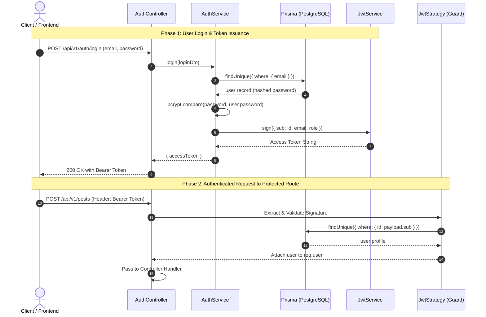
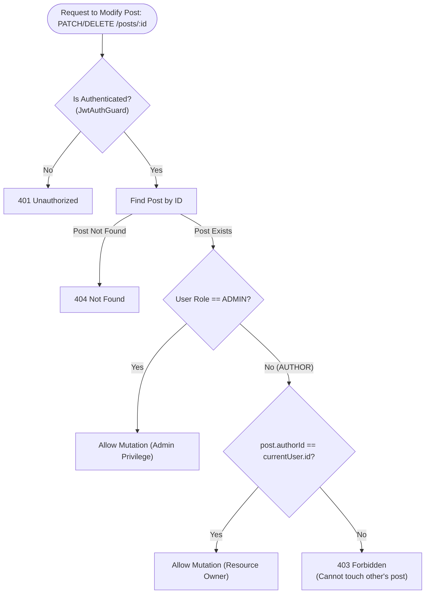
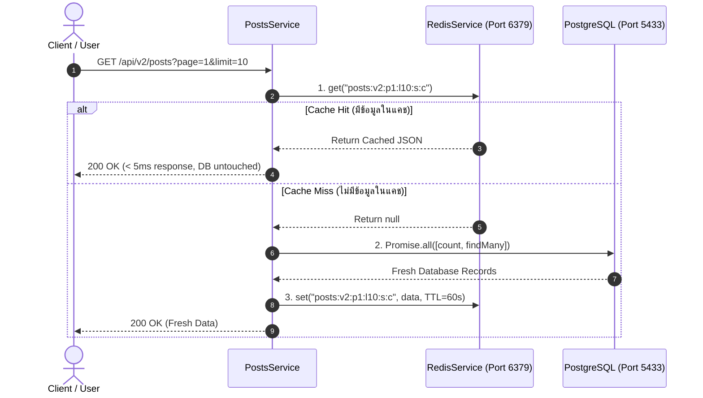
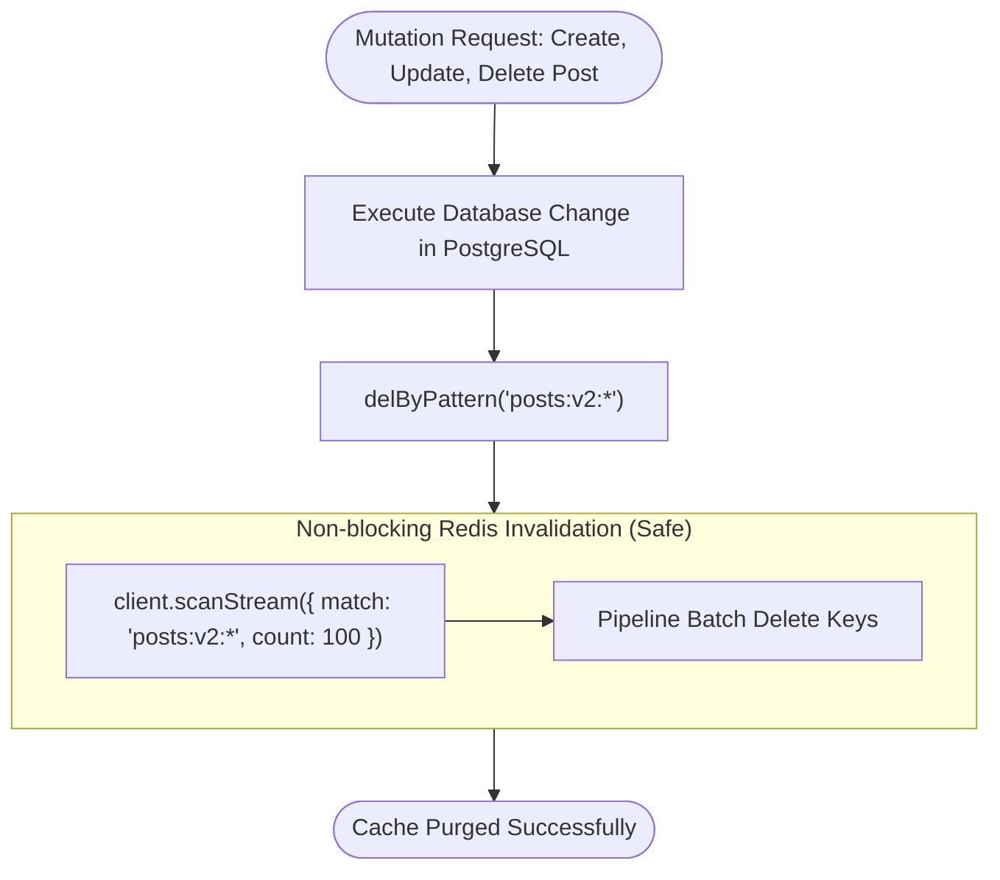

# NestJS Master Guide: From Zero to Backend Developer
*คู่มือเรียนรู้พื้นฐาน Backend Development ครบวงจรด้วย NestJS, PostgreSQL & Prisma*

> [ROADMAP] ต้องการลำดับการเริ่มอ่านและไฟล์ที่ต้องสำรวจทีละสเต็ป? เข้าไปดู [Roadmap การเรียนรู้ (LEARNING_ROADMAP.md)](./LEARNING_ROADMAP.md)

---

## สารบัญ (Table of Contents)
1. [ภาพรวมสถาปัตยกรรม NestJS (NestJS Architecture Overview)](#1-ภาพรวมสถาปัตยกรรม-nestjs)
2. [การออกแบบฐานข้อมูลด้วย Prisma ORM (Database Design & Relations)](#2-การออกแบบฐานข้อมูลด้วย-prisma-orm)
3. [DTO และระบบการตรวจสอบความถูกต้อง (DTOs & Validation)](#3-dto-และระบบการตรวจสอบความถูกต้อง)
4. [ระบบดักจับ Error และ Exception Filters (Error Handling)](#4-ระบบดักจับ-error-และ-exception-filters)
5. [API Versioning และ Routing Precedence (v1 vs v2)](#5-api-versioning-และ-routing-precedence)
6. [การตั้งค่าและการรันระบบ (Setup & Running Guide)](#6-การตั้งค่าและการรันระบบ)
7. [การทำ Unit Testing ด้วย Vitest และ Mocking (Testing & Quality)](#7-การทำ-unit-testing-ด้วย-vitest-และ-mocking)
8. [ระบบยืนยันตัวตนและการจำกัดสิทธิ์ (Auth & RBAC)](#8-ระบบยืนยันตัวตนและการจำกัดสิทธิ์-auth--rbac)
9. [ระบบแคชและ Invalidation ด้วย Redis (In-Memory Caching)](#9-ระบบแคชและ-invalidation-ด้วย-redis-in-memory-caching)

---

## 1. ภาพรวมสถาปัตยกรรม NestJS

NestJS ใช้โครงสร้างแบบ **Three-Tier Layered Architecture** ตามหลัก **Separation of Concerns (SoC)** โดยแยกส่วนการทำงานเป็น 3 ชั้นหลัก:



### Core Architectural Principles
| Concept | หน้าที่ใน NestJS | ตัวอย่างในโค้ด |
|---|---|---|
| **Controller** | กำหนด HTTP Methods (`GET`, `POST`, `PATCH`, `DELETE`) และจับคู่กับ URL path | `src/posts/posts.controller.ts` |
| **Service** | ประมวลผลตรรกะ, คำนวณข้อมูล, ติดต่อฐานข้อมูลหรือระบบภายนอก | `src/posts/posts.service.ts` |
| **Module** | รวมกลุ่ม Component ที่เกี่ยวข้องกัน และกำหนดสิ่งที่เปิดให้โมดูลอื่นใช้งาน (`exports`) | `src/posts/posts.module.ts` |
| **Dependency Injection** | ส่ง Service เข้าไปใน Constructor อัตโนมัติ โดยไม่ต้อง `new` เอง | `constructor(private readonly prisma: PrismaService) {}` |

---

## 2. การออกแบบฐานข้อมูลด้วย Prisma ORM

ไฟล์กำหนด Schema อยู่ที่: `prisma/schema.prisma`



### Referential Integrity Constraints Matrix
1. **`onDelete: Cascade` (User -> Post)**
   - เมื่อลบ User ผู้เขียน บทความทั้งหมดที่ผู้ใช้นี้เขียนจะถูกลบตามทันทีอัตโนมัติ
   - ป้องกันไม่ให้มีบทความที่ `authorId` ชี้ไปหา User ที่ไม่มีตัวตนในตาราง
2. **`onDelete: Restrict` (Category -> Post)**
   - หาก Category ยังมี Post อ้างอิงอยู่ Database จะ**ปฏิเสธคำสั่งลบ**
   - ช่วยรักษาข้อมูลบทความ ไม่ให้หมวดหมู่ของบทความสูญหายจนกลายเป็นข้อมูลกำพร้า

---

## 3. DTO และระบบการตรวจสอบความถูกต้อง

**DTO (Data Transfer Object)** คือคลาสที่ใช้ระบุโครงสร้างและข้อกำหนดของข้อมูลที่ Client ส่งมาใน Request Body หรือ Query String

### ตัวอย่าง: `CreatePostDto` (`src/posts/dto/create-post.dto.ts`)
```typescript
export class CreatePostDto {
  @ApiProperty({ example: 'NestJS Guide', description: 'Title' })
  @IsString()
  @IsNotEmpty()
  @MinLength(3)
  title: string;

  @ApiProperty({ example: 1, description: 'Author ID' })
  @IsInt()
  @Type(() => Number)
  authorId: number;
}
```

### ความปลอดภัยที่ได้จาก `ValidationPipe` ใน `src/main.ts`
- `whitelist: true`: ตัดฟิลด์แปลกปลอมที่ Client แอบส่งมาทิ้ง ป้องกันการแฮกแก้ไขฟิลด์สำคัญ (Mass Assignment)
- `forbidNonWhitelisted: true`: แจ้ง Error 400 ทันทีหากส่งฟิลด์ที่ไม่ตรงกับ DTO
- `transform: true`: แปลงชนิดข้อมูลจาก JSON payload ให้เป็น Object Instance ของ DTO ตาม Type จริง

---

## 4. ระบบดักจับ Error และ Exception Filters

ไฟล์ตัวกรองอยู่ที่:
- `src/common/filters/http-exception.filter.ts`
- `src/common/filters/all-exceptions.filter.ts`

### มาตรฐานโครงสร้าง Error ตอบกลับ:
```json
{
  "statusCode": 400,
  "timestamp": "2026-09-29T12:00:00.000Z",
  "path": "/api/v1/posts",
  "message": [
    "title must be longer than or equal to 3 characters",
    "authorId must be an integer number"
  ]
}
```

> [!IMPORTANT]
> **ลำดับการลงทะเบียน Filter ใน main.ts มีความสำคัญมาก**:
> `app.useGlobalFilters(new AllExceptionsFilter(), new HttpExceptionFilter());`
> ต้องวาง `AllExceptionsFilter` (จับ 500) ไว้ก่อน `HttpExceptionFilter` (จับ HTTP ปกติ) เพื่อให้ลำดับการประมวลผลดักจับ Error เฉพาะเจาะจงก่อน Error กว้างๆ

---

## 5. API Versioning และ Routing Precedence

ใน `src/main.ts` เปิดใช้งาน URI Versioning:
```typescript
app.setGlobalPrefix('api');
app.enableVersioning({
  type: VersioningType.URI,
  defaultVersion: '1',
});
```

### การเปรียบเทียบความสามารถ: Version 1 vs Version 2

| มิติการทำงาน | Version 1 (`/api/v1`) | Version 2 (`/api/v2`) |
|---|---|---|
| **การดึงบทความทั้งหมด** | ส่งกลับเป็น Array ทั้งก้อน (Raw Flat Array) | แบ่งหน้าด้วย **Database Pagination** (`skip`, `take`) |
| **การค้นหาและกรองข้อมูล** | ไม่มีระบบค้นหา | รองรับ Search Keyword และ Filter ตาม Category |
| **ระบบแคช (Redis)** | ไม่มีแคช วิ่งเข้า Database ทุกครั้ง | มี In-Memory Cache (Cache-Aside TTL 60s) |
| **ข้อมูลสถิติภาพรวม** | ไม่มี | มี Endpoint `/api/v2/posts/stats` รวมสถิติทั้งระบบ |
| **การคำนวณข้อมูลเสริม** | ข้อมูลบทความพื้นฐาน | เพิ่มการคำนวณ **Reading Time** และ **Related Posts** |

### กฎสำคัญ: Route Precedence (ลำดับการประกาศ Route)
ใน `src/posts/posts-v2.controller.ts`:
```typescript
// ถูกต้อง: Static route ต้องอยู่ก่อน Dynamic param route
@Get('stats')
getStats() { ... }

@Get(':id')
findOne(@Param('id', ParseIntPipe) id: number) { ... }
```
*หากวาง `@Get(':id')` ไว้ก่อน เมื่อมี Request มาที่ `/posts/stats` ตัวแปลงจะมองว่าคำว่า "stats" คือ ID แล้วแปลงเป็นตัวเลขไม่ผ่าน เกิด Error 400 ทันที*

---

## 6. การตั้งค่าและการรันระบบ

### รันโปรเจกต์ด้วยคำสั่งเดียว:
```bash
npm run start:dev
```
*สคริปต์ `scripts/start-dev.sh` จะเปิด Docker PostgreSQL (Port 5433) และ Redis 7 (Port 6379), ตรวจสอบความพร้อม, ซิงค์ Prisma Schema, และรัน NestJS Server อัตโนมัติ*

### ลิงก์สำคัญ:
- **Scalar Documentation (Modern Client)**: [http://localhost:3000/api/reference](http://localhost:3000/api/reference)
- **Swagger Documentation**: [http://localhost:3000/api/docs](http://localhost:3000/api/docs)
- **API Base URL**: [http://localhost:3000/api](http://localhost:3000/api)

### การเชื่อมต่อดูข้อมูลใน PostgreSQL:
- **DBeaver (GUI Desktop)**:
  - Host: `localhost`
  - Port: `5433` *(พอร์ตที่แมปจาก Docker Container)*
  - Database: `nestjs_blog`
  - User / Password: `postgres` / `postgres`
- **Prisma Studio (Web GUI)**:
  ```bash
  npx prisma studio   # เปิดดูตารางผ่าน Web UI ที่ http://localhost:5555
  ```

---

## 7. การทำ Unit Testing ด้วย Vitest และ Mocking

โปรเจกต์นี้ใช้ **Vitest** ควบคู่กับ **`vitest-mock-extended`** เพื่อทดสอบ Business Logic ในแต่ละ Service โดยไม่ต้องต่อ Database หรือ Redis จริง

### สถาปัตยกรรม Isolation ใน Unit Test



### รายการ Test Suites ทั้งหมด (46 Tests):
- `src/auth/auth.service.spec.ts` (7 tests)
- `src/auth/guards/roles.guard.spec.ts` (3 tests)
- `src/categories/categories.service.spec.ts` (7 tests)
- `src/users/users.service.spec.ts` (8 tests)
- `src/posts/posts.service.spec.ts` (13 tests: V1 CRUD, Ownership, V2 Pagination, Cache Hit/Miss, Invalidation)
- `src/redis/redis.service.spec.ts` (8 tests: get, set with TTL, del, delByPattern via scanStream)

### รูปแบบการเขียน Unit Test (AAA Pattern):
```typescript
it('ควรสร้างหมวดหมู่สำเร็จเมื่อชื่อไม่ซ้ำ', async () => {
  // 1. Arrange: ตั้งค่า Mock ให้ findUnique ตอบ null (ไม่ซ้ำ)
  prismaMock.category.findUnique.mockResolvedValue(null);
  prismaMock.category.create.mockResolvedValue({ id: 1, name: 'Tech', createdAt: new Date(), updatedAt: new Date() });

  // 2. Act: เรียก method ที่ต้องการทดสอบ
  const result = await service.create({ name: 'Tech' });

  // 3. Assert: ตรวจสอบผลลัพธ์
  expect(result.name).toBe('Tech');
  expect(prismaMock.category.create).toHaveBeenCalledOnce();
});
```

### คำสั่งรัน Test:
```bash
npm test            # รันการทดสอบทั้งหมด (46 tests)
npm run test:watch  # รันแบบ Watch Mode
npm run test:cov    # รายงาน Coverage
```

---

## 8. ระบบยืนยันตัวตนและการจำกัดสิทธิ์ (Auth & RBAC)

### 1. แผนภาพลำดับการทำงาน (Authentication Sequence Diagram)



### 2. Password Hashing ด้วย bcrypt
- รหัสผ่านก่อนบันทึกลงฟิลด์ `password` ใน Database จะต้องผ่าน `bcrypt.hash(password, 10)` เสมอ
- ตอน Login จะใช้ `bcrypt.compare(loginPassword, user.password)` ในการตรวจสอบความถูกต้อง

### 3. Role-Based Access Control & Ownership Verification Flow



### 4. สรุปความแตกต่างของ User Endpoints และสิทธิ์การเข้าถึง (RBAC Matrix)

| Endpoint | Method | Guard / Role | Description |
|---|---|---|---|
| `/api/v1/auth/register` | POST | Public | สมัครสมาชิกด้วยตนเองสำหรับผู้ใช้ทั่วไป กำหนด role เป็น `AUTHOR` โดยอัตโนมัติ และคืน JWT Access Token ทันที |
| `/api/v1/auth/login` | POST | Public | เข้าสู่ระบบเพื่อรับ JWT Access Token |
| `/api/v1/users` | POST | `JwtAuthGuard`, `RolesGuard` (`ADMIN`) | **Admin User Provisioning** - ผู้ดูแลระบบสร้างบัญชีผู้ใช้ใหม่ สามารถกำหนด role (`ADMIN` หรือ `AUTHOR`) ได้ |
| `/api/v1/users` | GET | Public | ดูรายการผู้ใช้ทั้งหมดในระบบ |
| `/api/v1/users/:id` | GET | Public | ดูข้อมูลผู้ใช้รายบุคคลพร้อมบทความที่เขียน |
| `/api/v1/users/:id` | PATCH | Public | แก้ไขข้อมูลผู้ใช้ |
| `/api/v1/users/:id` | DELETE | `JwtAuthGuard`, `RolesGuard` (`ADMIN`) | ลบผู้ใช้งานออกจากระบบ (เฉพาะ ADMIN เท่านั้น) |

---

## 9. ระบบแคชและ Invalidation ด้วย Redis (In-Memory Caching)

### 1. ทำไมระบบ Backend ต้องมี Cache Layer?
ในแอปพลิเคชันที่มีผู้ใช้งานพร้อมกันจำนวนมาก Endpoint ที่ถูกเรียกบ่อยที่สุดคือการอ่านข้อมูล (Read Queries เช่น `GET /api/v2/posts`) หากทุก Request วิ่งตรงไปยัง PostgreSQL Database:
- Database CPU จะทำงานหนักและเกิด Connection Pool Exhaustion
- Response Time ช้าลงตามขนาดข้อมูลและความซับซ้อนของ Query (`count`, `findMany`, `ORDER BY`, `LIMIT`)
- การนำ **Redis** ซึ่งเก็บข้อมูลใน **RAM (In-Memory)** มาเป็นตัวกลาง จะลด Response Time จาก ~50-100ms เหลือเพียง **ต่ำกว่า 5ms**

### 2. Cache-Aside Sequence Diagram (Hit vs Miss)



### 3. ระบบ Cache Invalidation (การล้างแคชอย่างปลอดภัย)
เมื่อมีการเปลี่ยนแปลงข้อมูลผ่านคำสั่ง **`create`**, **`update`**, หรือ **`remove`** ใน `PostsService`:
- Service จะส่งคำสั่งล้างแคช: `await this.redisService.delByPattern('posts:v2:*');`
- เพื่อให้ Client ที่เรียก `GET /api/v2/posts` ในครั้งถัดไป ได้รับข้อมูลที่ตรงกับความจริงใน Database เสมอ (Data Consistency)



> [!CAUTION] Production Warning: ห้ามใช้คำสั่ง `KEYS *` เด็ดขาด
> Redis ทำงานด้วยสถาปัตยกรรม Single-Threaded หากใช้คำสั่ง `KEYS *` ค้นหาข้อมูลใน Production ที่มีคีย์หลักแสนหรือหลักล้าน Redis จะถูกบล็อกจนระบบค้างทั้งหมด
> ในโปรเจกต์นี้ `RedisService.delByPattern` ใช้ **`scanStream`** (`SCAN`) ซึ่งทำงานแบบ **Non-blocking Batch Iteration** ลบทีละชุดอย่างปลอดภัยต่อ Production 100%

### 4. วิธีตรวจสอบข้อมูลใน Redis (CLI & GUI Tools)
1. **ดูผ่าน Terminal ด้วย `redis-cli` (ผ่าน Docker Container):**
   ```bash
   # เข้าสู่ interactive shell ของ Redis ใน Docker
   docker exec -it nestjs-blog-redis redis-cli

   # คำสั่งพื้นฐานที่ใช้บ่อย:
   KEYS *                           # ดูชื่อคีย์ทั้งหมดในแคช
   GET "posts:v2:p1:l10:s:c"         # ดู Value ข้อมูล JSON ในคีย์
   TTL "posts:v2:p1:l10:s:c"         # ตรวจสอบเวลาที่เหลือก่อนแคชหมดอายุ (วินาที)
   FLUSHALL                         # ล้างข้อมูลทั้งหมดใน Redis
   exit                             # ออกจาก redis-cli
   ```
2. **ดูผ่านโปรแกรม GUI (แนะนำ: Redis Insight - ฟรี):**
   - ดาวน์โหลดที่ [redis.io/insight](https://redis.io/insight/)
   - กด **Add Redis Database** -> กรอก Host: `localhost`, Port: `6379`
   - สามารถดู Key, Value, TTL, และสถิติ Memory Usage ได้แบบ Real-time Graphical Interface
